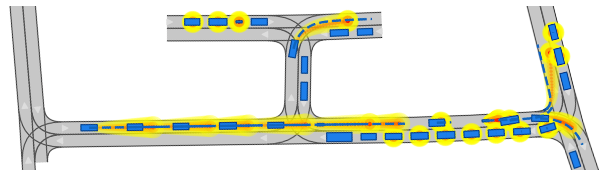

# Thesis: Robust and Computational-Efficient Vehicle Trajectory Prediction for Autonomous Driving through Deep Learning
Unfortunately, I am constrained from making the source code publicly available. Nevertheless, my final thesis document is stored in this repository as well as to videos of the multi-agent trajectory prediction visualization.
