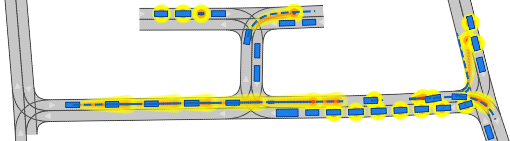
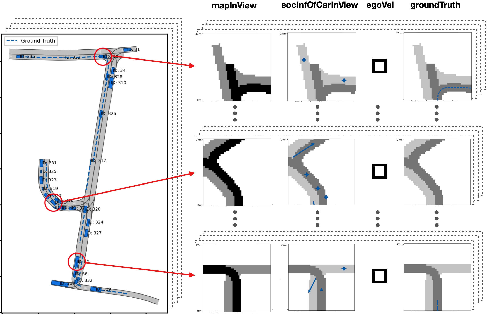
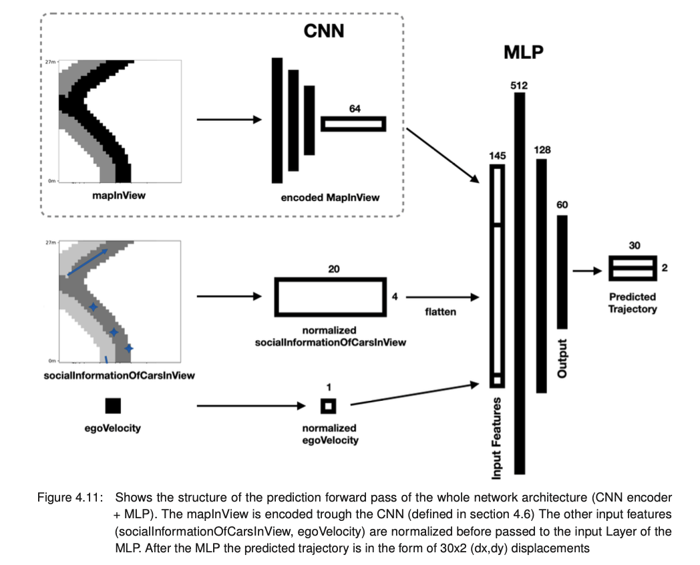
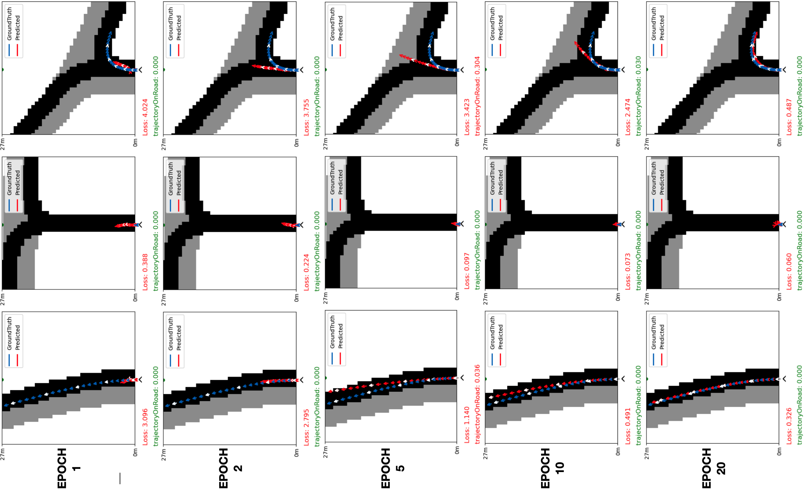

## Description

This is the source code of my bachelor thesis:
The main objective of this thesis is to create an input data pipeline and to train two neural networks for trajectory prediction. The goal is to predict the trajectories of each traffic participant in a given scenario as accurately as possible, matching the actual ground truth trajectories. This is achieved by iterating through all traffic participants in the given scenario at each timestep and make a robust trajectory prediction for each of them using the previously trained neural networks.

To assess the results, the correctness of the predictions is evaluated at each timestep. This evaluation involves calculating two standard evaluation metrics which are then averaged across all vehicles present. Additionally, a later-created video showcases both the ground truth and the predicted trajectories, displaying the displacement errors (evaluation metric) to quantify the accuracy and visually confirm the reliability of the predictions.

If you have any questions about my code or dataset, I´m happy to help. You can contact me by mail: **jakob.gollreiter@tum.de**

[](url){:height="70%" width="70%"}

The TUM-CommonRoad tool (https://commonroad.in.tum.de) is used as data source. 

## Table of Contents

- [Description](#description)
- [Dependencies](#dependencies)
- [Usage](#usage)
- [Module Overview](#module-overview)
- [Training the Networks](#training-the-networks)
- [Trajectory Prediction Videos](#trajectory-prediction-videos)
- [License](#license)


## Dependencies

You can install the required packages using the conda environment: **commonroad-prediction/baEnvironment.yml**

## Usage

The `main.py` script serves as the central component of this project. It facilitates the execution of the following tasks:

- **Data Generation**: Load one or multiple `.xml` files and generate input features and ground truth data to be used for trajectory prediction.

- **Prediction Inference**: Load a `.xml` file representing a scenario and choose a neural network model for predicting trajectories of all vehicles present in the scenario.

### Data Generation
!(url){:height="60%" width="60%"}

To generate input data and ground truth for trajectory prediction, do the following steps:
##### 1) Configure the config.ini file as follows:
- Set **arrayShape** to (39, 39) by default, representing the initial size of the mapInView input feature. Adjust this to any uneven square shape if needed. A smaller size is recommended for enhanced accuracy.
- Adjust **viewLength** to 27 to define the viewing scope for each vehicle. This establishes the extent of the observable horizon.
- Set **masterTimesteps** as 100, determining the duration of the scenario or its intended usage.
- If **buildImagesAndVideo** is set to **False**, the simulation data will be used to create images and videos. These files will document predictions and ground truth for every vehicle in the scenario, starting from an XML file.
- set **inference**  to **False**
- Toggle **predictionVisible** to **False** to control whether the output predictions should be visible or not.
- (Optional) Define **egoVehicleCrID** as 2, representing the crID of the ego vehicle that will be visually highlighted with a red circle and additional information. This will involve illustrating surrounding vehicles and their velocities using a pictogram.

##### 2) Configure the ScenarioLoader (in main.py main() forLoop) to load sceanrio for generating data:
In ScenarioLoader.py specify in get_scenario_folder_path() were your raw xml data is located

In main.py uncomment:
- get_scenario_folder_path() will choose all scenarios from a scenario folderpath  
and comment out:
- get_specific_scenario() 
- get_random_training_scenario()

##### 3) Configure data_generator.py module (enter the folder path, where the csv file should be stored):
Create a new folder db39/##YOUR-OUTPUT-FOLDER###  
  
The following line in data_generator.py was to be specified to your folder destination for the csv file (if you generate data from multiple scenarios, multiple csv files will be stored in here)

```bash
file_path = f'##YOUR-directory###/##YOUR-OUTPUT-FOLDER###/{filename}_{timestamp}TrainingData.csv'
e.g. file_path = f'db39/FlensburgTrainDataset/{filename}_{timestamp}TrainingData.csv'
``````

##### 4) Finally, start the data generation process with the script **main**:
```bash
python main.py
```

##### 5) Combining and cleaning data with filteringScenarios2CSV.py 
All CSV files in ##YOUR-directory###/##YOUR-OUTPUT-FOLDER### will be cleaned of currupted data and combined to one csv dataset file
just adapt the following line to your train folder 
```bash
os.chdir("##YOUR-directory###/##YOUR-OUTPUT-FOLDER###")
e.g. os.chdir("db39/FlensburgTrainDataset")
```
Now you have a comleted traing dataset(with the extension cleanedCombine.csv):
```bash
##YOUR-directory###/##YOUR-OUTPUT-FOLDER###/cleanedCombine.csv
e.g db39/FlensburgTrainDataset/cleanedCombine.csv
```
This dataset can now be utilised for training the neural networks (Encoder + MLP)


### Prediction inference 


To make multi-agent predicion for all vehicles present in a scenario, do the following steps:
##### 1) Configure the config.ini file as follows:
- Set **arrayShape** to (39, 39) by default, representing the initial size of the mapInView input feature. Adjust this to any uneven square shape if needed. A smaller size is recommended for enhanced accuracy.
-Adjust viewLength to 27 to define the viewing scope for each vehicle. This establishes the extent of the observable horizon.
- Set **masterTimesteps** as 100, determining the duration of the scenario or its intended usage.
- Set **buildImagesAndVideo** to **True**, the simulation data will be used to create images and videos. These files will document predictions and ground truth for every vehicle in the scenario, starting from an XML file.
- Set **inference** to **True**, it signifies inference mode, utilizing a loaded neural network model for making predictions.
- Toggle **predictionVisible** to **True** or False to control whether the output predictions should be visible or not.

- (Optional) Define **egoVehicleCrID** as e.g. 2, representing the crID of the ego vehicle that will be visually highlighted with a red circle and additional information. This will involve illustrating surrounding vehicles and their velocities using a pictogram.

##### 2) Configure the ScenarioLoader (in main.py main() forLoop) to load sceanrio for making the prediction:
**get_specific_scenario()** will choose a specific xml-scenario from the directory.
Therefore just specify one xml scenario, where the sequential Multi-Agent trajectory prediction should be performed on.  
```bash
e.g. scenarios/ComparisonTest/DEU_Flensburg-1_1_T-1.xml
```

##### 3) Configure the NeuralNets to load trained Neural Networks for prediction
In the function **loadNeuralNets(self)** of the NeuralNets.py module the networks(Encoder + MLP) can be choosen which are used for the prediction. Both of the architectures are defined previously.

For the encoder pick:
```bash
file_path = 'comparisonLinearVsCNNVsCNN/db39Model/notAugmented/combined.csv_CNNModelFlatten64x1x1CombinedTry_Epochs200_ValidationLoss:0.001812_lr:0.0003__2023_07_19_18:02:20.pth' # This is the convolutional encoder model used in this thesis   
```
 
For the Multi-Layer Perceptron pick: 

```bash
file_path = 'linearPredictionModels/db39/mega/cleanedCombine.csv_wholeNetPrototype5_Epochs_25_ValidationLoss0.442764_lr0.0003_2023_08_16_19:33:00.pth' # l1 + l2 loss (This is the MLP model used in the thesis)   
```


##### 4) Finally, start the multi-agent prediction inference process with the script **main**:
```bash
python main.py
```
If you set in confif.ini **buildImagesAndVideo** to **True**, **inference** to **True** and **predictionVisible** to **True** --> a MP4 video will be created showing the prediction for all vehicles. This is shown in the folder: **/video_trajectory_output**. The overall ADE and FDE error metric will be printed in the terminal.


## Module Overview
###### The following modules were implemented over the course of this thesis:
#### Modules in commonroad_prediction
1. ScenarioLoader.py (for loading XML files)
2. data_generator.py (for saving training data to CSV file)
3. toPointListConversion.py (for doing operations converting vectors to points etc.)
4. visualisation.py (for visualizing ground truth and predicted trajectories, and video creation and other ...)
5. visualization.py (for defining confidence ellipses for trajectory output predicitons)
6. NeuralNets.py (for loading the trained Encoder and MLP neural networks)
7. filteringScenarios2CSV (for combining trainig data and filtering out invalid data entries)
8. trajectoryPrediction.py (Train trajectory prediction MLP on GPU)
9. DisplacementError.py (for calculating ADE, FDE error metric)
10. LaneletOperations.py (for calcuating and analysing road network)
11. GroundTruth.py (for computing the groundTruth)
12. prediction_module (stand alone prediction module)
13. HelperFunctions.py (for basic mathematical operations)
14. normalization.39 (for normalizing the input and ground truth features)
15. main.py (core structure for data generation and inference of the prediction networks(Encoder and MLP))

#### Modules in comparisonLinearVsCNNVsCNN (Encoder)
16. LAE39ServerModelLinear64x1x1.py (Train Linear Autoencoder on GPU)
17. CAE39ServerModelFlatten64x1x1.py (Train Convolutional Autoencoder on GPU)

## Training the Networks
The trajectory prediction network architecture is composed out of two networks in series. The Encoder is there to encode the information of the mapInView input feature in order to get a compressed representation of it. Over the course of the thesis, two autoencoder architectures were designed and compared with another. One linear and one convolutional autoencoder were designed.  
In the **notebook commonroad-prediction/comparisonLinearVsCNNVsCNN/autoencoderComparison/compareLinearVsCNN39notAug.ipynb** the two trained autoencoders are **challenged and compared** with another. 
#[](url){:height="70%" width="70%"}
For the training of the MLP the following dataset is used: (../db39/mega/cleanedCombine.csv)  
For the training of the Encoders the following dataset is used (../db39/imageTrain2/combined.csv)  
Both of these datasets where created like described in Data Generation
### Training the Autoencoder -> Encoder
This is the training of an encoder that compresses the mapInView feature. A linear and a convolutional autoencoder are both trained and compared with each other.
{:height="50%" width="50%"}

##### Linear Autoencoder
The training of the linear autoencoder is done with the module **(../comparisonLinearVsCNNVsCNN/LAE39ServerModelLinear64x1x1.py)**
Here you should specify the correct path to a csv-file for example db39/imageTrain2/combine.csv or cleanedCombine.csv (cleaned version, not affecting mapInView feature)

##### Convolutional Autoencoder
The training of the convolutional autoencoder is done with the module **(../comparisonLinearVsCNNVsCNN/CAE39ServerModelFlatten64x1x1.py)**
Here you should specify the correct path to a csv-file for example db39/imageTrain2/combine.csv or cleanedCombine.csv (cleaned version, not affecting mapInView feature)

### Training the trajectory prediction Multi-Layer Perceptron 
{:height="42%" width="42%"}


The training of the trajectory prediction, MLP is done with the module **trajectoryPrediction.py**:
It is important to note that for the training the input features and trajectories are normalized with the Norms of folder (commonroad_prediction/NormsTest/)
The module is written to be executed on a GPU. For the training a training dataset and validation dataset (data generation) is needed. The training of the MLP also involves utilizing a trained encoder as described in (Training the Autoencoder -> Encoder).  
The encoder is trained iwth the db39/imageTrain2 dataset and is loaded in the following way:
```bash
file_path = os.path.join(workingDirectory,'##YOUR_ENCODER##')
encoder = ConvAutoencoder(encoder, decoder).to(device)
encoder = torch.load(file_path, map_location=torch.device('cuda'))
```

The Multi-Layer Perceptron is trained on the db39/mega dataset and is loaded in the following way:
```
e.g.
file_path = os.path.join(workingDirectory,'db39/imageTrain2/combined.csv_CNNModelFlatten64x1x1CombinedTry_Epochs200_ValidationLoss:0.001812_lr:0.0003__2023_07_19_18:02:20.pth')
learntCNN = ConvAutoencoder(encoder, decoder).to(device)
learntCNN = torch.load(file_path, map_location=torch.device('cuda'))
```

To do a test training **localy** one can also use the **commonroad_prediction/predictionNetRelDxDy.ipynb** notebook. Here one can visually see the training result improving over the epochs.


## Trajectory Prediction Videos
In the folder /video_trajectory_output there are three output prediction videos from a test set. If you create make your own prediction inference run the video will also be created in here.


